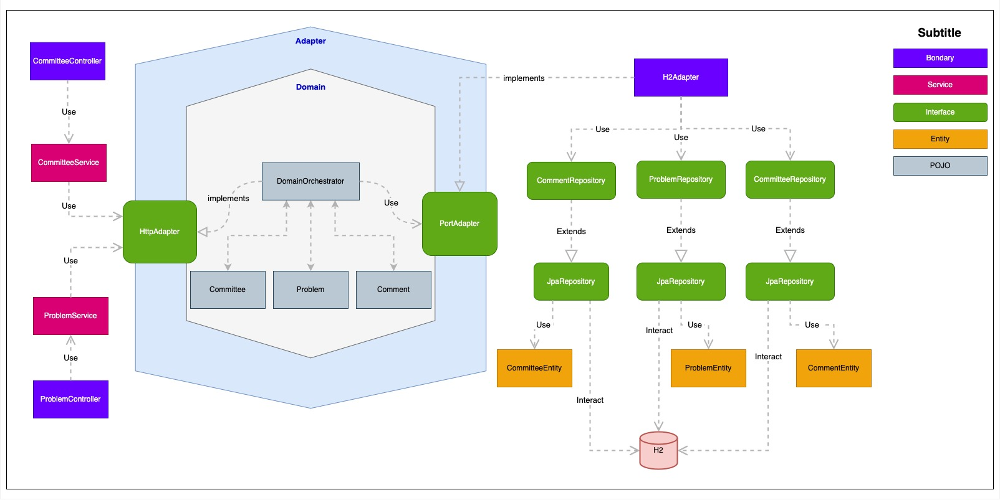

# README
## api-committee
Technical challenge for job opportunity

## Scenario
Problems are topics that are dealt with in committees.
A problem has a name and begins by being opened.
Then, when a comment has been added, it's ready to be added to a committee.

A committee is programmed in advance with a date and comprises several problems that will be dealt with during the committee session.
Problems can also be added to the committee via the committee.
Once a committee has started, it is in progress.
When the committee is finished, the director close the committee, and all problems on the agenda are closed.

## Solution

Application created following the principles of hexagonal architecture/clean architecture and DDD to manage problems and committees.

## Requirements
For building and running the application you need:

- [JDK 22](https://www.oracle.com/java/technologies/downloads/#java22)
- [Maven 3](https://maven.apache.org)
- [Docker 4 (If you want to use containers)](https://www.docker.com/products/docker-desktop/)
- [Insomnia](https://insomnia.rest/download)

## Running the application locally

There are several ways to run a Spring Boot application on your local machine. One way is to execute the `main` method in the `com/natixis/problem/ApiCommitteeApplication` class from your IDE.

Alternatively you can use the [Spring Boot Maven plugin](https://docs.spring.io/spring-boot/docs/current/reference/html/build-tool-plugins-maven-plugin.html) like so:

```shell
mvn spring-boot:run
```


## Documentation
### OpenAPI Definition
After start the application we can access the online swagger on `http://localhost:9090/swagger-ui/index.html` or clicking in [here](http://localhost:9090/swagger-ui/index.html)

### Insomnia
Another option for viewing the data persisted in the database is through an API visualization platform such as Insomnia, for this within the `umls` folder, there is a JSON file name [Insomnia_2024-05-01.json](umls/Insomnia_2024-05-01.json) with some collections examples that can be imported to test our endpoints. application.


### Database Access
To check the data persisted in the database, when the application is running on port 9090, access the database interface through URL `http://localhost:9090/h2-console/` or by clicking
[here](http://localhost:9090/h2-console/)


### Application Architecture


#### Architecture Details
The [hexagonal architecture](https://en.wikipedia.org/wiki/Hexagonal_architecture_(software)), or ports and adapters architecture, is an architectural pattern used in software design. It aims at creating loosely coupled application components that can be easily connected to their software environment by means of ports and adapters. This makes components exchangeable at any level and facilitates test automation.


## Future Improvements

- Expand integrated tests, as due to the short space of time some were carried out as a demonstration of knowledge.
- Create unit tests for Domain classes.
- Implement Sonar to control test coverage.
- Although docker-compose is already created for MySQL, the application is using the H2 database.
- Implement performance monitoring with Actuator, Prometheus and Grafana.

## Copyright

Released under the Apache License 2.0. See the [LICENSE](https://github.com/codecentric/springboot-sample-app/blob/master/LICENSE) file.